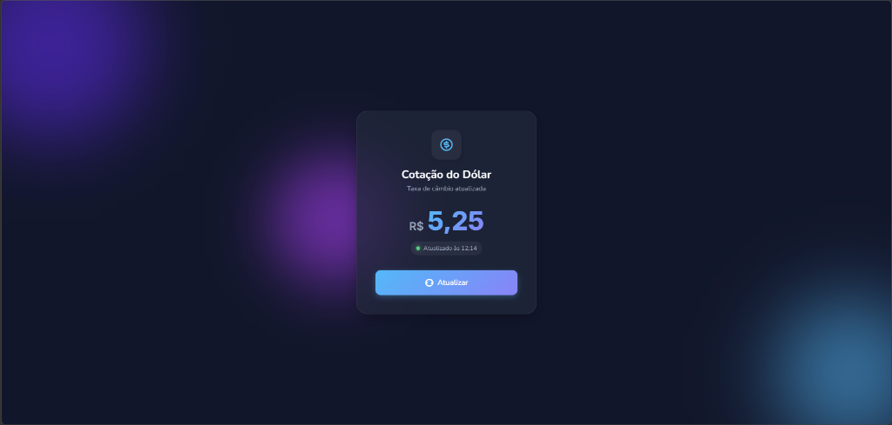
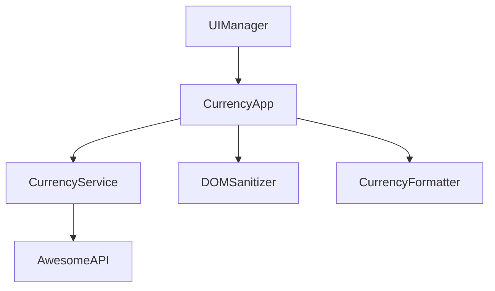

# 💵 Cotação Dólar 

 

---

## 🇧🇷 Português (PT-BR)

### 📋 Sobre o Projeto
O **Cotação Dólar** é uma aplicação web moderna para acompanhamento da taxa de câmbio em tempo real. Este projeto foi desenvolvido como um exemplo de **Refatoração Premium**, aplicando princípios de **Arquitetura Limpa (Clean Architecture)**, **SOLID** e as melhores práticas de segurança da **OWASP**.

### 🏗️ Estrutura Técnica (Layered Architecture)
O projeto utiliza uma estrutura desacoplada para garantir facilidade de manutenção e testabilidade:

- **Security & Utilities (`DOMSanitizer`, `CurrencyFormatter`)**: Responsáveis pela sanitização de dados e formatação visual.
- **Data Layer (`CurrencyService`)**: Abstração da comunicação com a API externa (AwesomeAPI).
- **UI Layer (`UIManager`)**: Gerenciamento direto do DOM e estados visuais.
- **Controller Logic (`CurrencyApp`)**: Orquestrador que conecta o serviço de dados à interface do usuário.

### 📊 Diagrama de Arquitetura

### 🎯 Princípios Aplicados

| Princípio | Implementação no Projeto | Benefício |
| :--- | :--- | :--- |
| **SRP** | Classes distintas para Sanitização, Formatação, API e UI. | Código fácil de entender e modificar. |
| **OCP** | Estrutura de classes permite adicionar novos formatadores ou serviços sem alterar a lógica core. | Extensibilidade sem riscos. |
| **DIP** | O Controller recebe instâncias de serviço e UI via Injeção de Dependência. | Facilita a criação de Testes Unitários e Mocks. |
| **OWASP** | Uso de `textContent` e `DOMSanitizer.escapeHTML` para prevenir XSS. | Segurança robusta contra injeções de script. |

---

## 🇺🇸 English (EN)

### 📋 About the Project
**Cotação Dólar** is a modern web application for real-time exchange rate tracking. This project was developed as a **Premium Refactoring** example, applying **Clean Architecture**, **SOLID** principles, and **OWASP** security best practices.

### 🏗️ Technical Structure (Layered Architecture)
The project uses a decoupled structure to ensure maintainability and testability:

- **Security & Utilities (`DOMSanitizer`, `CurrencyFormatter`)**: Responsible for data sanitization and visual formatting.
- **Data Layer (`CurrencyService`)**: Abstracts communication with the external API (AwesomeAPI).
- **UI Layer (`UIManager`)**: Manages the DOM directly and handles visual states.
- **Controller Logic (`CurrencyApp`)**: Orchestrator that connects the data service to the user interface.

### 🎯 Applied Principles

- **Single Responsibility (SRP)**: Each class has one unique and clear job.
- **Dependency Injection (DI)**: Classes are initialized with their dependencies, making the code modular.
- **Output Encoding**: All values displayed in the DOM are sanitized to prevent XSS attacks.

### 🚀 Como executar / How to run
Como o projeto utiliza separação de responsabilidades em JavaScript, recomenda-se o uso de um servidor HTTP para uma experiência completa:
1. Clone o repositório.
2. Abra o arquivo `index.html` utilizando a extensão **Live Server** no VS Code ou qualquer servidor estático de sua preferência.

---

> [!NOTE]
> Este projeto foi gerado e documentado pelo **Sandeclaw** seguindo os padrões de excelência em engenharia de software.
